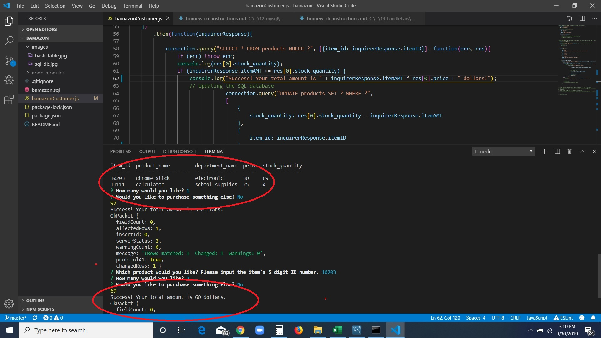

# bAmazon
### GA Tech Coding Boot Camp
 bAmazon is a CLI (command line interface) app that mimics an Amazon-type online store. Choose from a variety of items listed in a table, place your order, and the app will calculate your purchase. 
 
 ## How to use
    * In your local terminal, open up the file using this command: node bamazonCustomer.js   
     
    * A table will appear that displays 10 different items.
    * Choose an item by its item_id number and then specify the quantity you would like.
    * Note that the product's quantity diminishes and your check-out price is calculated!
    

## Created With
    * Node.js
    * Inquirer.js
    * MySQL
    ![./images/price.jpg]
